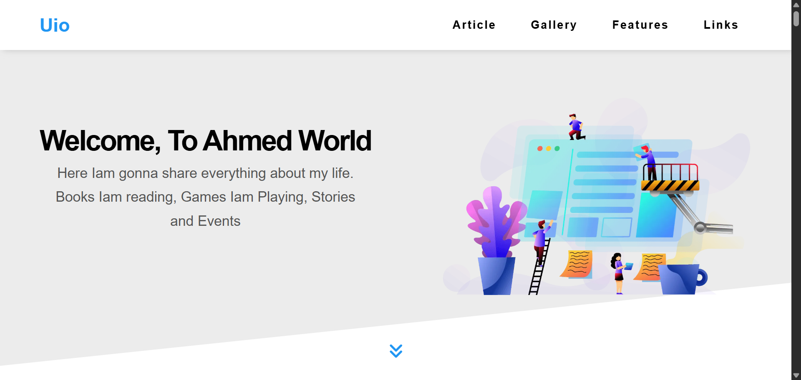
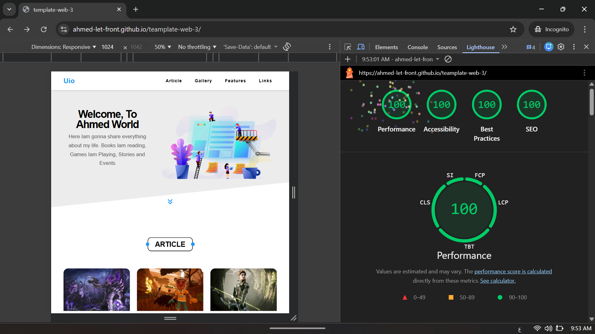

# 🌊 UIO - THE ELITE PORTFOLIO TEMPLATE

### 🏆 Achieving the "Golden Score" in Web Performance & Core Web Vitals

  

---

[**🌐 Explore Live Demo**](https://ahmed-let-front.github.io/teamplate-web-3/)

---

### 🛠️ CORE TECH STACK

|                                                                                                           |                                                                                                        |                                                                                                                              |                                                                                                                          |
| :-------------------------------------------------------------------------------------------------------: | :----------------------------------------------------------------------------------------------------: | :--------------------------------------------------------------------------------------------------------------------------: | :----------------------------------------------------------------------------------------------------------------------: |
|  |  |  |  |
|     |     |                         |                       |

## 🚀 HIGH-END PERFORMANCE ENGINEERING

Optimization is at the heart of Uio. This project implements advanced techniques to achieve sub-second load times.

### 💎 Performance Highlights:

- **Zero-Latency Asset Loading:** By self-hosting all fonts and icons via **NPM**.
- **Resource Prioritization:** Using `<link rel="preload">` for critical LCP elements.
- **Efficient Composite Layers:** Strategic use of `will-change` to offload animations to the GPU.
- **Tailwind JIT & Purge:** Drastically reduced final CSS bundle size.

---

## 🔍 LIGHTHOUSE AUDIT: THE PERFECT SCORE

| Core Web Vital                     | Score / Value | Engineering Strategy                                |
| :--------------------------------- | :-----------: | :-------------------------------------------------- |
| **Performance**                    |    🟢 100     | Preloading, Asset Minification, WebP Compression    |
| **LCP (Largest Contentful Paint)** |   ⚡ 0.5 s    | Preloading critical hero image & zero-latency fonts |
| **TBT (Total Blocking Time)**      |    ⏱️ 0 ms    | Efficient JS execution & chunking via Vite          |
| **CLS (Cumulative Layout Shift)**  |     📐 0      | Explicit image dimensions & `font-display: swap`    |
| **Accessibility & SEO**            |    🟢 100     | ARIA Roles, Semantic HTML, Schema ready             |

---

## 👨‍💻 THE CRAFTSMAN: AHMED YASSER

> "True engineering is not just about making it work; it's about making it perfect."
> I am a **15-year-old Junior Front-End Developer** with a relentless obsession for performance.

- **Daily Commitment**: Dedicated **8 to 10 hours** of focused deep-work and coding.
- **Project Portfolio**: Delivered **15+ high-performance projects** focusing on modern UI/UX.
- **Goal**: Mastering the browser rendering engine to build the next generation of web applications.

---

# 🚀 يويو - عالم الاحتراف (القالب الثالث)

الوصول للعلامة الكاملة ليس مجرد صدفة، بل هو نتيجة هندسة دقيقة "تحت المحرك":

- **إدارة الموارد**: استضافة الخطوط والأيقونات محلياً لتقليل طلبات HTTP.
- **معالجة الرسوم**: استخدام `will-change` لضمان معالجة الأنميشن عبر كارت الشاشة بدون التأثير على الـ Main Thread (TBT = 0ms).
- **استقرار الواجهة (CLS = 0)**: استخدام `font-display: swap` لضمان عدم حدوث أي إزاحة في التصميم أثناء التحميل.

### 👨‍💻 رحلتي: الانضباط والتميز

أنا **أحمد**، مطور واجهات أمامية عمري 15 عاماً. أؤمن أن الموهبة وحدها لا تكفي، لذلك أستثمر **8 إلى 10 ساعات يومياً** في صقل مهاراتي التقنية. هذا المشروع نتاج آلاف الساعات من البحث والتطبيق، حيث أنجزت **15 مشروعاً** في وقت قياسي.

### 📞 تواصل معي (Contact)

|                                                                            LinkedIn                                                                             |                        GitHub                         |                       Email                       |      WhatsApp      |
| :-------------------------------------------------------------------------------------------------------------------------------------------------------------: | :---------------------------------------------------: | :-----------------------------------------------: | :----------------: |
|  | [Ahmed-let-front](https://github.com/Ahmed-let-front) | [letcosdgp@gmail.com](mailto:letcosdgp@gmail.com) | `+20 105 011 9571` |

